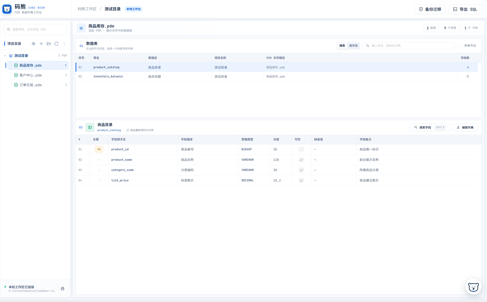
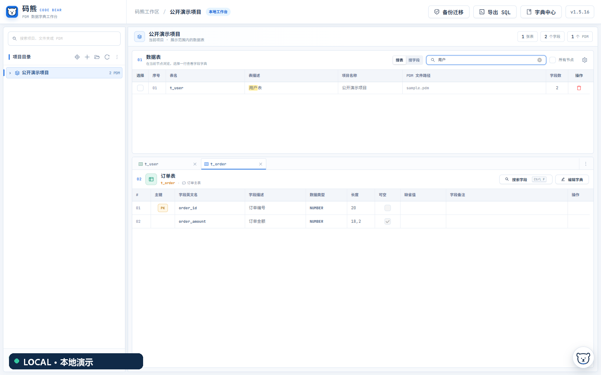
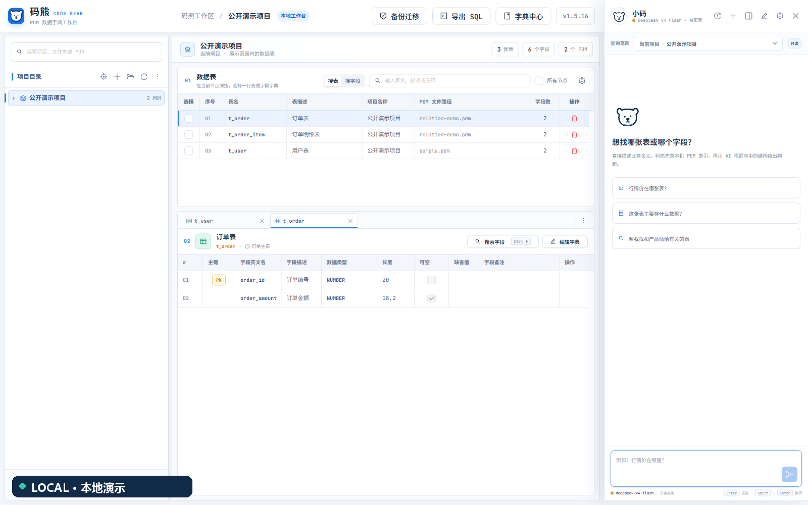
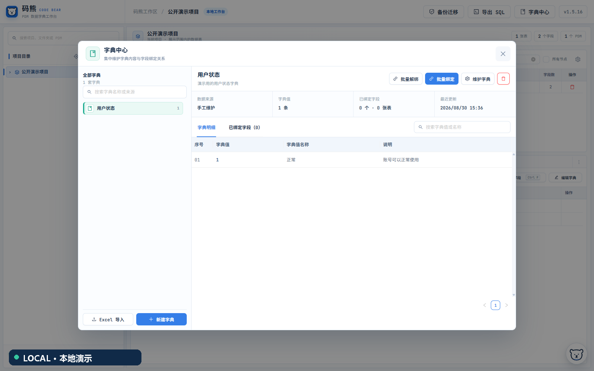
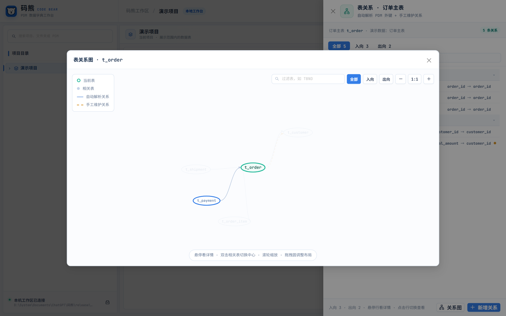
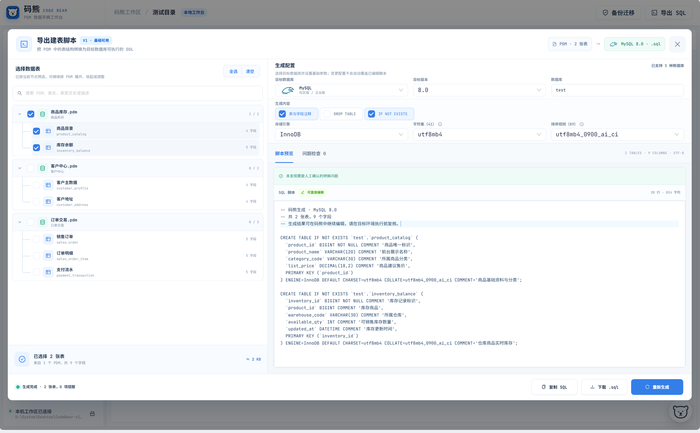

# 码熊 CodeBear

码熊是一款本地运行的 PowerDesigner PDM 数据字典工具。它可以集中管理 PDM，查看和搜索表字段，维护数据字典与表关系，也可以直接生成建表脚本。

> 当前稳定版本：`v1.5.15` · 支持 Windows 10/11 x64 与 macOS 13+ Apple Silicon

## 功能

- 按项目和目录管理 `.pdm` 文件，浏览表、字段、主键、类型和备注。
- 按表名、描述、注释或字段快速搜索，并记住最近打开的数据表以优化后续排序。
- 可在搜索偏好中关闭或清除搜索记忆。
- 在“编辑字典”中新增、修改或删除字段，并可维护表名称、代码和描述。
- 数据表支持单独删除和批量删除；结构变更前自动备份 PDM。
- 支持回收站和备份迁移。
- 从 Excel 导入业务字典，将字典绑定到字段后随时查询。
- 查看 PDM 外键关系，也可以手工补充和维护表关系。
- 生成 MySQL、Oracle、达梦、TDSQL MySQL 版和 Apache Ignite 建表脚本。
- 可选接入 DeepSeek AI 助手，通过自然语言查询数据字典；悬浮入口可自由拖动并记忆位置。
- 自动检查新版本，并根据当前系统提供对应的安装包。

## 界面预览

### 浏览 PDM 数据字典

按项目目录集中管理 PDM，在同一工作区查看数据表及其字段明细。

### 搜索表与字段

按表名、描述、注释或字段快速检索，并在结果中高亮匹配内容。

### AI 助手

使用自然语言查询本地数据字典。AI 功能完全可选，需要配置用户自己的 DeepSeek API Key。

### 字典中心

统一维护业务字典：手工编辑、Excel 批量导入（字典值列可多选组合唯一值）以及字段绑定查询。

### 表关系

自动解析 PDM 外键，也可以手工维护表关系，并通过列表或关系图查看。

### 导出建表脚本

选择 PDM 或数据表，配置目标数据库参数，预览并下载生成的 DDL。

## 下载

- Windows 10/11 x64：`CodeBear-v1.5.15-win-x64.zip`
- macOS 13 及以上 Apple Silicon：`CodeBear-v1.5.15-mac-arm64.dmg`

请前往 [GitHub Releases](https://github.com/Eco1i/CodeBear/releases/tag/v1.5.15) 下载。Windows 和 macOS 是两个独立安装包，请按自己的系统选择。

当前 Mac 版只支持 M 系列芯片，暂不支持 Intel Mac。

## 安装与升级

### Windows

完整解压 ZIP 后，双击 `CodeBear.exe` 即可使用。程序启动后会自动打开浏览器。

升级时建议把新版本解压到新目录，再通过码熊的“备份迁移”导入旧版数据。Windows 数据保存在程序同级的 `data` 目录。

### macOS

打开 DMG，把 `CodeBear.app` 拖入“应用程序”即可。码熊启动后会显示在菜单栏。

当前版本未经过 Apple 公证。首次启动时，请在 Finder 中右键 `CodeBear.app`，选择“打开”；如果系统仍然拦截，请前往“系统设置 > 隐私与安全性”选择仍要打开。

升级时先退出旧版，再把新版拖入“应用程序”并选择替换。数据保存在 `~/Library/Application Support/CodeBear`，替换应用不会删除原有数据。

## 数据与隐私

- 码熊只操作导入到工作区的 PDM 副本，不会修改原始 PDM。
- Windows 的数据保存在程序同级 `data`；macOS 的数据保存在 `~/Library/Application Support/CodeBear`。
- AI 助手需要你自己的 DeepSeek API Key。密钥由当前系统账户加密保存，在 Mac 上使用登录钥匙串。
- 使用 AI 提问时，相关问题和表字段信息会发送给 DeepSeek，但不会上传完整 PDM 文件。
- 码熊仅在本机运行，不会向局域网或公网开放服务。

## 更新记录

版本发布说明见 [CHANGELOG.md](CHANGELOG.md)，各平台发行包见 [GitHub Releases](https://github.com/Eco1i/CodeBear/releases)。

## 许可证

码熊使用 [MIT License](LICENSE)。
