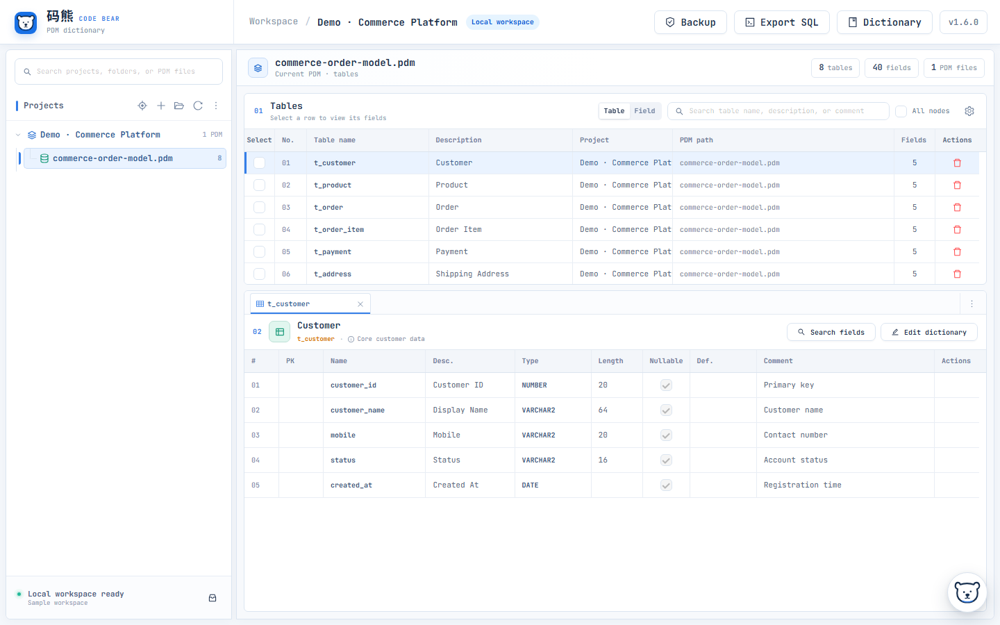
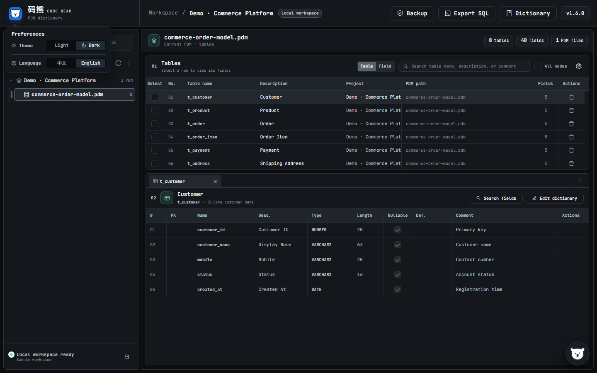
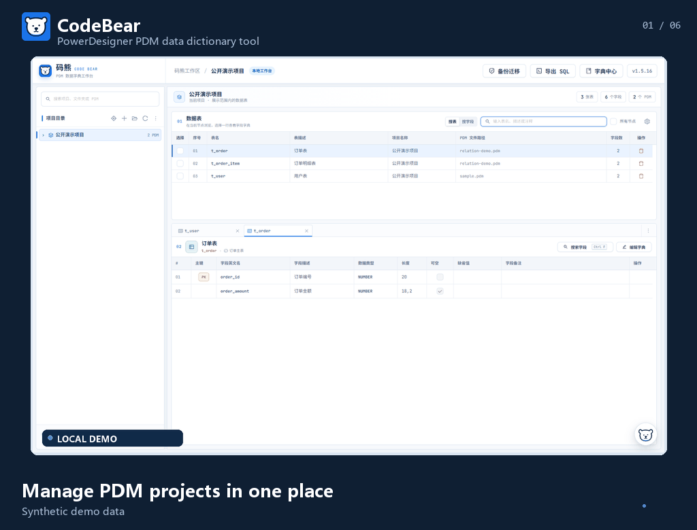

# CodeBear — PowerDesigner PDM Data Dictionary Tool

[中文说明](README.zh-CN.md) · **English**

> Turn PowerDesigner PDM files into a searchable, maintainable, local data dictionary workspace.

CodeBear is built for database designers, backend engineers, and data-governance teams that need to inspect and maintain PowerDesigner PDM files over time. It organizes models by project and brings table and field search, dictionary maintenance, relationship review, and DDL export into one local workspace—without uploading complete PDM files to an online service.

- **Latest stable version:** `v1.6.0`
- **Supported systems:** Windows 10/11 x64; macOS 13+ on Apple Silicon
- **How it runs:** the desktop app starts a local service and opens the workspace in your browser

## Problems CodeBear helps solve

- Find tables, fields, descriptions, and comments in large or inherited PDM models.
- Keep structural documentation aligned with the model instead of maintaining a separate, stale spreadsheet.
- Bind business dictionaries to fields so status codes and other enumerations remain understandable.
- Review foreign-key relationships and document additional relationships that are missing from the model.
- Generate DDL for a target database without manually reconstructing table definitions.
- Back up structural changes and use the recycle bin or backup migration to recover from mistakes.

## Core capabilities

- **PDM browsing and search:** organize `.pdm` files by project and directory, search table and field metadata, and compare multiple tables in tabs.
- **Safer structural maintenance:** edit table and field definitions with automatic backups; conflicts and write failures stop the update instead of silently overwriting data.
- **Business dictionaries:** maintain values manually or import them from Excel, bind dictionaries to fields, and inspect where they are used.
- **Table relationships:** parse PDM foreign keys, maintain additional manual relationships, and explore upstream and downstream tables in list or graph views.
- **DDL export:** generate table scripts for MySQL, Oracle, Dameng, TDSQL MySQL, and Apache Ignite.
- **Local backup and migration:** use the recycle bin, selective backups, and `.cbbak` files to move workspace data between installations.
- **Optional AI assistant:** use your own DeepSeek API key to ask natural-language questions about the current data dictionary.

## Interface preview

### PDM data dictionary workspace

Projects, tables, and field details stay together in one workspace designed for ongoing work with large models.

### Light and dark themes, Chinese and English interface

Choose a light or dark theme and switch the application interface between Chinese and English. Table names, field names, and other PDM data are never translated.

## Product tour

## Download

Download the package and SHA-256 checksum for your platform from [GitHub Releases](https://github.com/Eco1i/CodeBear/releases).

| Platform | Package |
| --- | --- |
| Windows 10/11 x64 | `CodeBear-v1.6.0-win-x64.zip` |
| macOS 13+ Apple Silicon | `CodeBear-v1.6.0-mac-arm64.dmg` |

Windows and macOS packages are independent. The macOS build supports Apple Silicon only; Intel Macs are not currently supported.

## Install and upgrade

### Windows

1. Download the ZIP and extract it completely into a new directory.
2. Double-click `CodeBear.exe`; the workspace opens in your browser.
3. Application data is stored in the `data` directory beside the executable.

For an upgrade, do not overwrite a directory that is still running. Extract the new version into a separate directory, then use **Backup Migration** to import data from the previous installation.

### macOS

1. Open the DMG and drag `CodeBear.app` into **Applications**.
2. Launch CodeBear from Finder.
3. Application data is stored in `~/Library/Application Support/CodeBear`; replacing the app does not remove workspace data.

The current macOS build is not notarized. On first launch, right-click `CodeBear.app` in Finder and choose **Open**. If macOS still blocks it, use **System Settings > Privacy & Security > Open Anyway**.

## Data safety and privacy

- CodeBear runs locally and listens only on the loopback interface; it does not expose a service to your LAN or the public internet.
- Imported PDM files are copied into the CodeBear workspace, so later edits do not modify the original PDM.
- Structural edits and deletions back up the workspace copy first. External changes or write failures stop the operation.
- The AI assistant is optional and requires your own DeepSeek API key.
- AI questions send the question, recent conversation, and retrieved project/PDM paths plus table and field metadata to DeepSeek. Complete PDM files are not uploaded.
- API keys saved through the app are encrypted for the current system account; macOS uses the login Keychain. You can also provide `DEEPSEEK_API_KEY` as an environment variable.

## Development and release history

- Development setup, tests, and contribution guidelines: [CONTRIBUTING.md](CONTRIBUTING.md)
- Version history: [CHANGELOG.md](CHANGELOG.md)
- Per-release notes: [docs/releases](docs/releases)

## License

CodeBear is released under the [MIT License](LICENSE).
