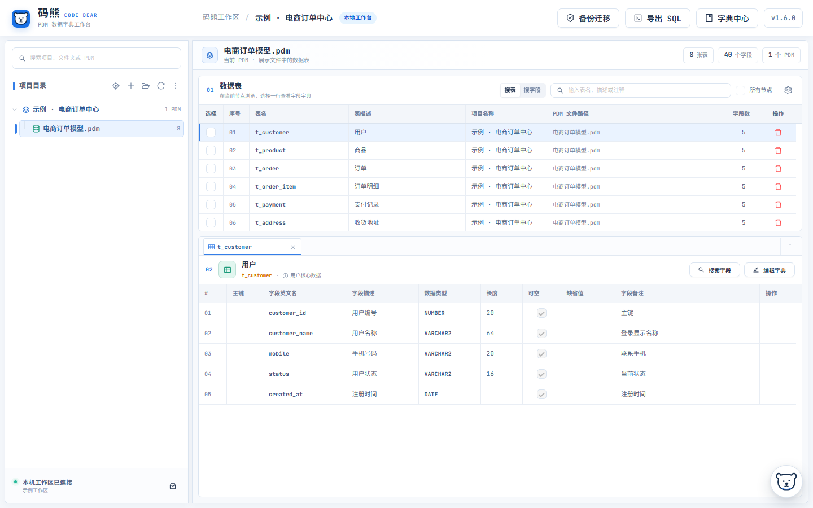
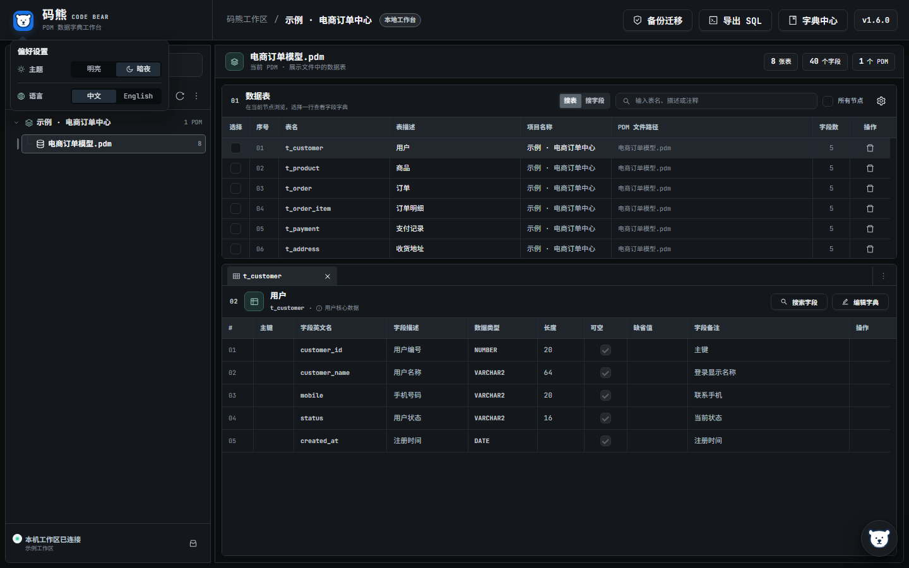
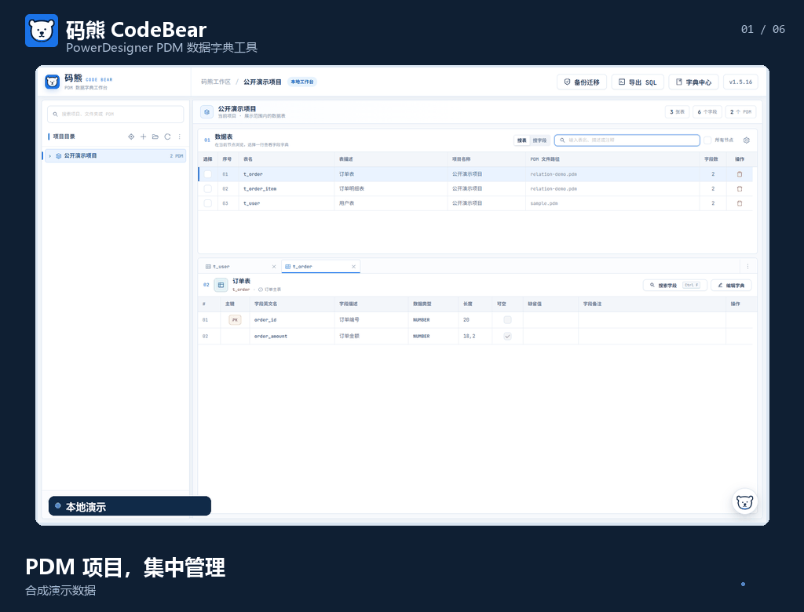

# 码熊 CodeBear：PowerDesigner PDM 数据字典工具

**中文** · [English](README.md)

> 将 PowerDesigner PDM 整理成可搜索、可维护、可交付的本地数据字典工作台。

码熊面向需要长期查看和维护 PowerDesigner PDM 的数据库设计、后端研发和数据治理人员。它按项目管理 PDM，在一个工作台中完成表与字段检索、数据字典维护、关系梳理和建表脚本导出，无需把完整 PDM 上传到在线服务。

- **当前稳定版本：** `v1.6.0`
- **支持系统：** Windows 10/11 x64；macOS 13 及以上 Apple Silicon
- **运行方式：** 桌面程序启动本机服务，并在浏览器中打开工作台

## 适合解决什么问题

- 接手大型或历史 PDM 时，快速定位表、字段、描述和注释。
- 统一补充和修订表结构说明，减少数据字典与模型脱节。
- 将业务字典绑定到字段，明确状态码、类型码等枚举含义。
- 查看 PDM 外键关系，并补充模型中缺失的手工关系。
- 按目标数据库生成 DDL，减少重复整理建表脚本的工作。
- 在结构调整前保留备份，并通过回收站和备份迁移降低误操作风险。

## 核心能力

- **PDM 浏览与检索：** 按项目和目录管理 `.pdm` 文件，搜索表名、字段名、描述和注释，并在多标签页中对照不同数据表。
- **安全维护表结构：** 编辑表名称、代码、描述和字段定义；结构修改前自动备份，发生冲突或写回失败时停止覆盖。
- **业务字典：** 手工维护或从 Excel 导入字典值，将字典绑定到字段并查询使用范围。
- **表关系：** 解析 PDM 外键关系，维护额外的手工关系，并通过列表或关系图查看上下游。
- **DDL 导出：** 为 MySQL、Oracle、达梦、TDSQL MySQL 版和 Apache Ignite 生成建表脚本。
- **本地备份与迁移：** 使用回收站、选择性备份和 `.cbbak` 迁移工作区数据。
- **可选 AI 助手：** 使用自己的 DeepSeek API Key，以自然语言查询当前数据字典。

## 界面预览

### PDM 数据字典工作台

项目目录、数据表和字段明细集中在同一工作区，适合持续查阅和维护大型模型。

### 明亮 / 暗夜主题与中英文界面

可按使用环境切换明亮或暗夜主题，并在中文与 English 界面之间切换；表名、字段名和其他 PDM 业务数据保持原样。

## 功能演示

## 下载

请前往 [GitHub Releases](https://github.com/Eco1i/CodeBear/releases) 下载对应平台的安装包和 SHA-256 校验文件。

| 平台 | 安装包 |
| --- | --- |
| Windows 10/11 x64 | `CodeBear-v1.6.0-win-x64.zip` |
| macOS 13+ Apple Silicon | `CodeBear-v1.6.0-mac-arm64.dmg` |

Windows 和 macOS 安装包不能混用。macOS 版仅支持 Apple Silicon（M 系列芯片），暂不支持 Intel Mac。

## 安装与升级

### Windows

1. 下载 ZIP，并完整解压到一个新目录。
2. 双击 `CodeBear.exe`，程序会在浏览器中打开工作台。
3. 数据保存在程序同级的 `data` 目录。

升级时不要直接覆盖正在运行的旧目录。将新版本解压到新目录，再通过“备份迁移”导入旧版数据。

### macOS

1. 打开 DMG，将 `CodeBear.app` 拖入“应用程序”。
2. 从 Finder 启动码熊。
3. 数据保存在 `~/Library/Application Support/CodeBear`，替换应用不会删除工作区数据。

当前 macOS 版未经过 Apple 公证。首次启动时可在 Finder 中右键选择“打开”；如果系统仍然拦截，请前往“系统设置 > 隐私与安全性”允许打开。

## 数据安全与隐私

- 码熊在本机运行，只监听本机回环地址，不向局域网或公网开放服务。
- 导入 PDM 时会复制文件到码熊工作区，后续编辑不会修改原始 PDM。
- 表结构修改和删除操作会先备份工作区中的 PDM；检测到外部变化或写回失败时会停止操作。
- AI 助手完全可选，需要配置自己的 DeepSeek API Key。
- 使用 AI 提问时，问题、近期对话以及检索到的项目/PDM 路径和表/字段元数据会发送给 DeepSeek；完整 PDM 文件不会上传。
- 通过应用设置保存的 API Key 会按当前系统账户加密；macOS 使用登录钥匙串。也可以通过环境变量 `DEEPSEEK_API_KEY` 配置。

## 开发与发布记录

- 开发环境、测试和贡献方式：[CONTRIBUTING.md](CONTRIBUTING.md)
- 版本变更：[CHANGELOG.md](CHANGELOG.md)
- 各版本发布说明：[docs/releases](docs/releases)

## 许可证

码熊使用 [MIT License](LICENSE) 开源。
